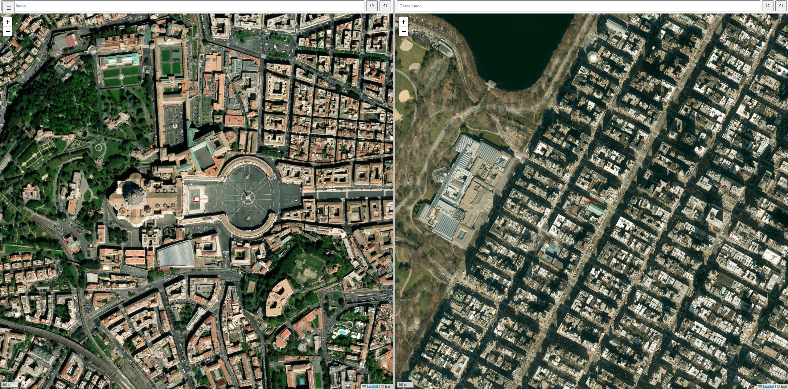

# Dual Map Comparator

**Dual Map Comparator** is a web-based interactive tool for visually comparing two geographical locations side by side using satellite imagery. It allows users to examine differences in scale, urban layout, and landscapes with precision and ease.

## Demo / Try it Live

You can try the application online here:  
[https://adebiasi.github.io/dual-map-comparator/](https://adebiasi.github.io/dual-map-comparator/)

  
*Two satellite views with synchronized zoom, independent rotation, and a predefined comparison panel.*

## Features

- **Two Independent Map Views**  
  Pan, rotate, and search independently on each map.

- **Zoom Synchronization**  
  Shared zoom level for accurate scale comparisons.

- **Satellite Imagery**  
  High-resolution Esri World Imagery tiles.

- **Rotatable Views**  
  Each map can be rotated independently for visual alignment.

- **Textual Search**  
  Search for locations independently using OpenStreetMap’s Nominatim service.

- **Predefined Comparison Pairs**  
  Side panel with curated pairs of locations and recommended zoom levels.

- **Visual Enhancements**  
  Central crosshairs, metric scale bars, and a clear divider between the two maps.

